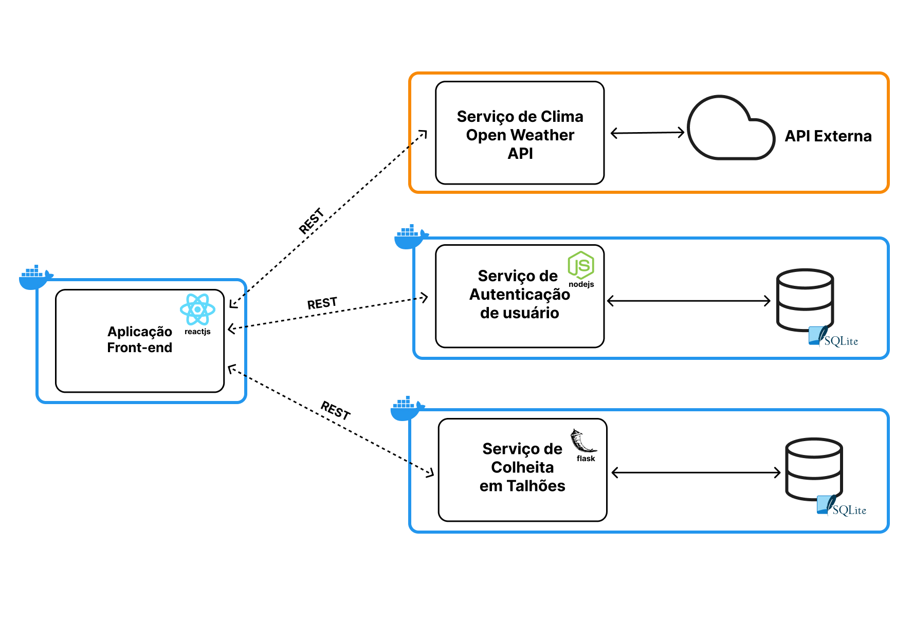

<p align="center" style="margin: 40px 0">
    
</p>

<div align="center">


</div>

# Agriprecision - Serviço de Autenticação de Usuário

Seu plantio sustentável e eficiente.

**Agriprecision** tem como objetivo contribuir para a agricultura de precisão, definindo os requisitos das safras e do solo para se obter uma produtividade eficiente, com a preservação de recursos e assegurar a sustentabilidade ambiental. Assim, contribuindo para [o documento da ONU dos Objetivos de Desenvolvimento Sustentável](https://brasil.un.org/pt-br/sdgs).

Projeto desenvolvido para o MVP na Sprint: **Arquitetura de Software** da Pós Graduação de Engenharia de Software da PUC-Rio.


## Arquitetura de Software Desenvolvida

O projeto foi desenvolvido em uma arquitetura baseada em microsserviços, na qual uma aplicação front-end monolítica gerencia todo o estado e o comportamento, enquanto utiliza microsserviços de apoio para recuperar dados ou executar as operações necessárias. Os microsserviços utilizados são: Serviço de autenticação, Serviço de dados do clima e Serviço de colheitas em talhões, que podem ser observados melhor no diagrama a seguir.




### Acesso aos componentes da Arquitetura

- [Aplicação Front-end](https://github.com/MicaelRiboura/agriprecisionWebApp)
- [Serviço de Colheitas em Talhões](https://github.com/MicaelRiboura/agriPrecisionHarvestService)
-  **Serviço de Autenticação de Usuário (Repositório Atual)**
-  [Serviço de Clima de Weather API](https://github.com/MicaelRiboura/agriprecisionWebApp/blob/develop/weather-api.docs.md)

## Como executar a aplicação com Docker

### 1 - Clonando o repositório
Antes de tudo, precisamos clonar o projeto para ser executado em sua máquina. Você pode clonar esse repositório fazendo o download por meio de um arquivo ZIP ou através do seguinte comando:

```
git clone https://github.com/MicaelRiboura/agriPrecisionUserService.git
```

> ⚠️ Após clonar o repositório, é necessário ir ao diretório raiz do projeto, pelo terminal, para poder executar os comandos descritos abaixo.

### 2 - Criando arquivo *.env*

O próximo passo é criar o arquivo com as configurações de ambiente. Para isso, crie um arquivo com o nome `.env` e preencha-o com as chaves presentes abaixo e os valores corretos:

```
SECRET_KEY=
PORT=3333
```

> ⚠️ Atenção! Esse exemplo possui apenas as chaves sem valores. Para conseguir executar a aplicação sem nenhum problema, é necessário que preencha manualmente o valor da chave secreta de autenticação para executar em sua máquina.

### 3 - Criando a imagem Docker
Primeiro, você deve criar uma imagem Docker com o seguinte comando:

```
docker build -t agri-authentication-service . 
```

### 4 - Rodando container Docker
Para executar um container Docker com base na imagem criada através do seguinte comando:

```
docker run -p 3333:3333 agri-authentication-service
```

Ao final, cole esse endereço no seu navegador para visualizar a documentação da API e suas rotas:

```
localhost:3333/docs
```


## Como executar a aplicação sem Docker

## 1 - Clonando o repositório
Antes de tudo, precisamos clonar o projeto para ser executado em sua máquina. Você pode clonar esse repositório fazendo o download por meio de um arquivo ZIP ou através do seguinte comando:

```
git clone https://github.com/MicaelRiboura/agriPrecisionUserService.git
```

> ⚠️ Após clonar o repositório, é necessário ir ao diretório raiz do projeto, pelo terminal, para poder executar os comandos descritos abaixo.

### 2 - Criando arquivo *.env*

O próximo passo é criar o arquivo com as configurações de ambiente. Para isso, crie um arquivo com o nome `.env` e preencha-o com as chaves presentes abaixo e os valores corretos:

```
SECRET_KEY=
PORT=
```

> ⚠️ Atenção! Esse exemplo possui apenas as chaves sem valores. Para conseguir executar a aplicação sem nenhum problema, é necessário que preencha manualmente os valores, como a porta de execução da aplicação e a chave secreta de autenticação para executar a API em sua máquina.

#

Para executar a aplicação é necessário ter todas as libs (bibliotecas) python listadas no arquivo `package.json` instaladas. 

#

### 3 - Instalando as dependências

Para instalar as libs listadas no arquivo `package.json`, execute o comando abaixo:

```
npm install
```
### 4 - Executando a API
Para executar a API, basta executar o seguinte comando:

```
node src/server.js
```

Ao final, cole esse endereço no seu navegador para visualizar a documentação da API e suas rotas:

```
localhost:3333/docs
```
